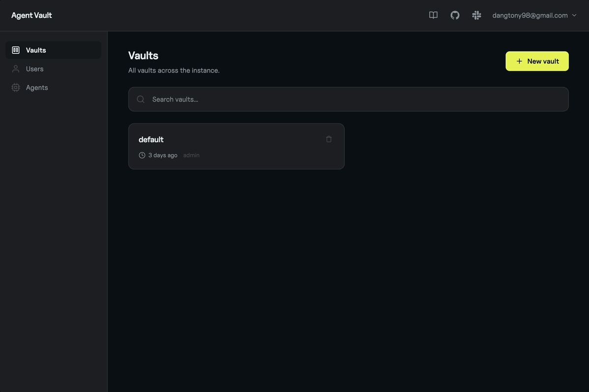

<p align="center">
  
</p>

<p align="center"><strong>HTTP credential proxy and vault</strong></p>

<p align="center">
An open-source credential broker by <a href="https://infisical.com">Infisical</a> that sits between your agents and the APIs they call.<br>
Agents should not possess credentials. Agent Vault eliminates credential exfiltration risk with brokered access.
</p>

<p align="center">
<strong>New here? The <a href="https://infisical.com/blog/agent-vault-the-open-source-credential-proxy-and-vault-for-agents">launch blog post</a> has the full story behind Agent Vault.</strong>
</p>

<p align="center">
<a href="https://docs.agent-vault.dev">Documentation</a> | <a href="https://docs.agent-vault.dev/installation">Installation</a> | <a href="https://docs.agent-vault.dev/reference/cli">CLI Reference</a> | <a href="https://infisical.com/slack">Slack</a>
</p>

<p align="center">
  
</p>

## Why Agent Vault

Traditional secrets management relies on returning credentials directly to the caller. This breaks down with AI agents, which are non-deterministic systems vulnerable to prompt injection that can be fooled into leaking its secrets.

Agent Vault takes a different approach: **Agent Vault never reveals vault-stored credentials to agents**. Instead, agents route HTTP requests through a local proxy that injects the right credentials at the network layer.

- **Brokered access, not retrieval** - Your agent gets a scoped session and a local `HTTPS_PROXY`. It calls target APIs normally, and Agent Vault injects the right credential at the network layer. Credentials are never returned to the agent.
- **Works with any agent** - Custom Python/TypeScript agents, sandboxed processes, and coding agents like Claude Code, Cursor, and Codex. Anything that speaks HTTP.
- **Encrypted at rest** - Credentials are encrypted with AES-256-GCM using a random data encryption key (DEK). An optional master password wraps the DEK via Argon2id, so rotating the password does not re-encrypt credentials. A passwordless mode is available for PaaS deploys.
- **Request logs** - Every proxied request is persisted per vault with method, host, path, status, latency, and the credential key names involved. Bodies, headers, and query strings are not recorded. Retention is configurable per vault.

## Installation

See the [installation guide](https://docs.agent-vault.dev/installation) for full details.

### Script (macOS / Linux)

```bash
curl -fsSL https://get.agent-vault.dev | sh
agent-vault server -d
```

Supports macOS (Intel + Apple Silicon) and Linux (x86_64 + ARM64).

### [Docker](https://docs.agent-vault.dev/self-hosting/docker)

```bash
docker run -it -p 14321:14321 -p 14322:14322 -v agent-vault-data:/data infisical/agent-vault
```

For non-interactive environments (Docker Compose, CI, detached mode), pass the master password as an env var:

```bash
docker run -d -p 14321:14321 -p 14322:14322 \
  -e AGENT_VAULT_MASTER_PASSWORD=your-password \
  -v agent-vault-data:/data infisical/agent-vault
```

### From source

Requires [Go 1.25+](https://go.dev/dl/) and [Node.js 22+](https://nodejs.org/).

```bash
git clone https://github.com/Infisical/agent-vault.git
cd agent-vault
make build
sudo mv agent-vault /usr/local/bin/
agent-vault server -d
```

The server starts the HTTP API on port `14321` and a TLS-encrypted transparent HTTPS proxy on port `14322`. A web UI is available at `http://localhost:14321`.

## Quickstart

### CLI — local agents (Claude Code, Cursor, Codex, OpenClaw, Hermes, OpenCode)

Wrap any local agent process with `agent-vault run` (long form: `agent-vault vault run`). Agent Vault creates a scoped session, sets `HTTPS_PROXY` and CA-trust env vars, and launches the agent — all HTTPS traffic is transparently proxied and authenticated:

```bash
agent-vault run -- claude
```

The agent calls APIs normally (e.g. `fetch("https://api.github.com/...")`). Agent Vault intercepts the request, injects the credential, and forwards it upstream. The agent never sees secrets.

For **non-cooperative** sandboxing — where the child physically cannot reach anything except the Agent Vault proxy, regardless of what it tries — launch it in a Docker container with egress locked down by iptables:

```bash
agent-vault run --sandbox=container -- claude
```

See [Container sandbox](https://docs.agent-vault.dev/guides/container-sandbox) for the threat model and flags.

### SDK — sandboxed agents (Docker, Daytona, E2B)

For agents running inside containers, use the SDK from your orchestrator to mint a session and pass proxy config into the sandbox:

```bash
npm install @infisical/agent-vault-sdk
```

```typescript
import { AgentVault, buildProxyEnv } from "@infisical/agent-vault-sdk";

const av = new AgentVault({
  token: "YOUR_TOKEN",
  address: "http://localhost:14321",
});
const session = await av
  .vault("default")
  .sessions.create({ vaultRole: "proxy" });

// certPath is where you'll mount the CA certificate inside the sandbox.
const certPath = "/etc/ssl/agent-vault-ca.pem";

// env: { HTTPS_PROXY, NO_PROXY, NODE_USE_ENV_PROXY, SSL_CERT_FILE,
//         NODE_EXTRA_CA_CERTS, REQUESTS_CA_BUNDLE, CURL_CA_BUNDLE,
//         GIT_SSL_CAINFO, DENO_CERT }
const env = buildProxyEnv(session.containerConfig!, certPath);
const caCert = session.containerConfig!.caCertificate;

// Pass `env` as environment variables and mount `caCert` at `certPath`
// in your sandbox — Docker, Daytona, E2B, Firecracker, or any other runtime.
// Once configured, the agent inside just calls APIs normally:
//   fetch("https://api.github.com/...") — no SDK, no credentials needed.
```

See the [TypeScript SDK README](sdks/sdk-typescript/README.md) for full documentation.

## Development

```bash
make build      # Build frontend + Go binary
make test       # Run tests
make web-dev    # Vite dev server with hot reload (port 5173)
make dev        # Go + Vite dev servers with hot reload
make docker     # Build Docker image
```

## Open-source vs. paid

This repo available under the [MIT expat license](https://github.com/Infisical/infisical/blob/main/LICENSE), with the exception of the `ee` directory which will contain premium enterprise features requiring a Infisical license.

If you are interested in Infisical or exploring a more commercial path for Agent Vault, take a look at [our website](https://infisical.com/) or [book a meeting with us](https://infisical.cal.com/vlad/infisical-demo).

## Contributing

Whether it's big or small, we love contributions. Agent Vault follows the same contribution guidelines as Infisical.

Check out our guide to see how to [get started](https://infisical.com/docs/contributing/getting-started).

Not sure where to get started? You can:

- Join our <a href="https://infisical.com/slack">Slack</a>, and ask us any questions there.

## We are hiring!

If you're reading this, there is a strong chance you like the products we created.

You might also make a great addition to our team. We're growing fast and would love for you to [join us](https://infisical.com/careers).

---

> **Preview.** Agent Vault is in active development and the API is subject to change. Please review the [security documentation](https://docs.agent-vault.dev/learn/security) before deploying.
